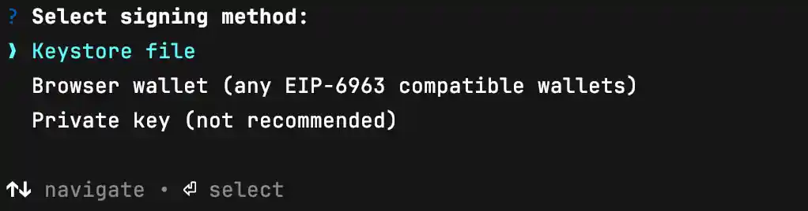

# @agentlyhq/agently-cli

CLI for registering agents to the [ERC-8004](https://eips.ethereum.org/EIPS/eip-8004) IdentityRegistry.


## Installation

```bash
bun add -g @agentlyhq/agently-cli
```

Or run directly with `bunx`:

```bash
bunx @agentlyhq/agently-cli register --help
```

## Usage

### Register an Agent

Register a new agent to the IdentityRegistry with multiple wallet options:

#### Using Keystore (Recommended)

Sign with an Ethereum keystore (V3) JSON file:

```bash
agently-cli register --uri "./metadata.json" --chain sepolia --keystore ~/.foundry/keystores/default
```

#### Using Browser Wallet

Opens a localhost page to sign with any browser extension wallet (MetaMask, Rabby, etc.) that are `EIP-6963` compliant:

```bash
agently-cli register --uri "ipfs://Qm..." --chain sepolia --browser
```

> **Note:** `--rpc-url` cannot be used with `--browser`. The browser wallet uses its own RPC endpoint.

#### Using Private Key Env (Not Recommended)

For scripting and CI:

```bash
# Not recommended for interactive use
PRIVATE_KEY=0x... agently-cli register --uri "ipfs://Qm..." --chain sepolia
```

#### Interactive Mode

If no wallet option is provided, you'll be prompted to choose:

```bash
agently-cli register --uri "ipfs://Qm..." --chain sepolia
```



#### Local Development

Register against a local Foundry/Anvil node:

```bash
agently-cli register \
  --chain localhost \
  --registry 0x5FbDB2315678afecb367f032d93F642f64180aa3 \
  --rpc-url http://localhost:8545 \
  --uri "./metadata.json" \
  --keystore ~/.foundry/keystores/default
```

### Options

| Option                 | Description                                                                          |
| ---------------------- | ------------------------------------------------------------------------------------ |
| `--uri <uri>`          | Agent metadata URI or path to `.json` file (converts to base64 data URI)             |
| `--chain <chain>`      | Target chain: `mainnet`, `sepolia`, `base-sepolia`, `localhost` (default: `sepolia`) |
| `--rpc-url <url>`      | Custom RPC URL (cannot be used with `--browser`)                                     |
| `--registry <address>` | IdentityRegistry contract address (required for `localhost`)                         |
| `--keystore <path>`    | Path to Ethereum keystore (V3) JSON file                                             |
| `--browser`            | Use browser extension wallet                                                         |

### Environment Variables

| Variable      | Description                           |
| ------------- | ------------------------------------- |
| `PRIVATE_KEY` | Private key for signing (use caution) |

### Supported Chains

| Chain          | Chain ID | Network                  |
| -------------- | -------- | ------------------------ |
| `mainnet`      | 1        | Ethereum mainnet         |
| `sepolia`      | 11155111 | Ethereum Sepolia testnet |
| `base-sepolia` | 84532    | Base Sepolia testnet     |
| `localhost`    | 31337    | Local Foundry/Anvil node |

## Development

```bash
# Install dependencies
bun install

# Run directly
bun run src/index.ts register --help

# Build
bun run build

# Test
bun test
```
